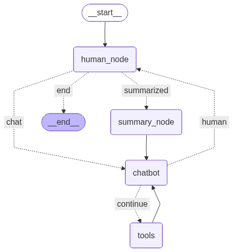

# Local Agent using Ollama + LangGraph  
*A fully local, modular, agentic RAG system with ingestion, retrieval, memory, and tool routing.*

This repository is my personal sandbox for building a **local‑first agentic AI system** using:

- **Ollama** for LLMs and embeddings  
- **LangGraph** for agent orchestration  
- **LangChain** for tools and document abstractions  
- **SQLite** for vector storage and long‑term memory  

Everything runs **offline**, on a laptop, with no external APIs.

---

## Goals

Build a RAG system that I would actually use:

- Local‑only execution for privacy  
- Modular ingestion → chunking → embedding → vector storage  
- ReAct‑style agent with tool routing  
- Persistent conversation memory  
- Continuous querying of ingested documents  
- Support for PDFs, Markdown, and text files  
- External lookup tools (e.g., Wikipedia)  
- Clean architecture with services and separation of concerns  

<p align="center">
  
</p>


# Project Structure

The `rag/` directory is the heart of the system. It’s designed for **modularity**, **extensibility**, and **local‑first operation**.

# Core Modules (`core/`)

These modules implement the ingestion → chunking → embedding → storage pipeline.

### **`chunking.py`**
Splits raw text into semantically meaningful chunks using `RecursiveCharacterTextSplitter`.  
Future expansion includes richer metadata tagging (page numbers, sections, etc.).

### **`data_ingestion.py`**
Loads and cleans:

- `.pdf` (via PyMuPDF)
- `.md` (via `MarkdownTextSplitter`)
- `.txt`

Returns clean text + file type.

### **`embedding.py`**
Embeds text using:

```
EMBED_MODEL = "mxbai-embed-large:335m"
```
Returns `np.float32` embeddings ready for storage.

### **`vectors.py` — Rewritten JSON‑Metadata VectorStore**

- JSON‑encoded metadata  
- Raw float32 embedding blobs  
- Normalized cosine similarity  
- Clean, safe schema  
- Round‑trip metadata handling  

Methods:

- `add_document(content, title, metadata, embedding)`  
- `query_documents(query_embedding, search_type="similarity", top_k=3)`  


# Services Layer (`services/`)

A clean abstraction layer that prevents dependency triangles and keeps the agent logic simple.

### **`ingestion_service.py`**
Pipeline:  
read → chunk → embed → store  
Returns a summary of what was ingested.

### **`retrieval_service.py`**
Embeds a query and retrieves top‑k documents using the VectorStore.

### **`memory_service.py`**
Wraps the SQLite memory store for:

- loading summaries  
- saving summaries  
- retrieving last thread ID  
- reading conversation history  

# Agent Logic (`agent/`)

### **`ReAct_agent.py`**
Implements a LangGraph‑based ReAct agent with:

- `human_node` → receives user input  
- `chat` → LLM reasoning  
- `ToolNode` → routes to tools  
- `summary_node` → compresses memory  
- `should_continue` → determines next step  
- `tools_condition` → decides when to call tools  

This creates a **persistent‑thread**, tool‑using, memory‑aware agent.

### **`tool_file.py`**
Defines the agent’s tools:

- `wiki_search(term)`  
- `add_file(filepath)`  
- `retriever_tool(query, search_type)`  

These tools call the services layer, not core modules directly.

# Utilities (`utils/`)

### **`log_handler.py`**
Structured logging for ingestion, retrieval, and agent actions.

### **`check_db.py`**
Helper script for inspecting the SQLite schema.


# Data (`data/`)

Contains:

- `rag_store.db` — unified SQLite database for:
  - vector embeddings  
  - JSON metadata  
  - conversation memory  


# Agent Lifecycle

1. **Ingestion**  
   `add_file()` loads a document → chunks → embeds → stores in SQLite.

2. **Interaction**  
   `human_node()` receives user input and routes it through the graph.

3. **Retrieval**  
   `retriever_tool()` queries the VectorStore using cosine similarity or dot product.

4. **Memory**  
   `save_memory()` stores summaries + message history per thread.

5. **Tool Routing**  
   `tools_condition()` and `should_continue()` determine whether to call tools, continue reasoning, or summarize.

---

# 📄 File Summary

| File | Purpose |
|------|---------|
| `main.py` | Entry point; generates unique thread IDs |
| `ReAct_agent.py` | LangGraph agent logic |
| `chunking.py` | Text chunking |
| `data_ingestion.py` | PDF/TXT/MD ingestion |
| `embedding.py` | Embedding generation |
| `vectors.py` | JSON‑metadata SQLite vector store |
| `tool_file.py` | Wikipedia search, ingestion, retrieval tools |
| `ingestion_service.py` | Document ingestion pipeline |
| `retrieval_service.py` | Query embedding + retrieval |
| `memory_service.py` | Conversation memory |
| `log_handler.py` | Logging |
| `check_db.py` | DB inspection |

---

# Future Directions

- Add ingestion for `.py`, `.html`, and `.ipynb`  
- Richer metadata tagging (page numbers, headings, chunk indices)  
- MMR retrieval and hybrid scoring  
- Plugin‑style tool registry  
- Better summarization + reducer logic for long‑term memory  
- Document registry table for tracking sources  


# Setup Instructions

```bash
git clone https://github.com/kidd1492/expert_in_a_box.git
cd expert_in_a_box
```
