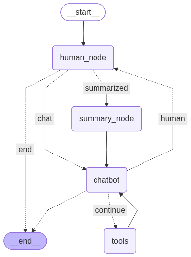

# Local Agent using Ollama, LangGraph

This repository is a personal sandbox for experimenting with agentic AI systems using LangGraph, LangChain, and Ollama—all running locally on a laptop.

**Goals:**

Build a RAG system that I would actually use. Run everything locally using Ollama, LangGraph, and LangChain
for privacy. Explore streaming responses, memory, chunking, ingestion, and retrieval. It should enable general question answering in a back-and-forth chat format. It should also be able to store documents of various types in a vectorstore, Implement RAG capabilities with file tracking. It should have an integrate external lookup (e.g., web search) and should support continuous querying of ingested documents.

<p align="center">
  
</p>

### `rag/`

The `rag/` directory is the heart of the system. It’s designed for modularity, extensibility, and local-first operation. Below is a breakdown of its components:

### Core Modules

`core/`  
Handles the ingestion, chunking, embedding, and storage of documents.

- `chunking.py`: Splits raw text into tagged chunks with metadata (e.g., topic, section).
- `data_ingestion.py`: Loads and cleans `.pdf`, `.txt`, and `.md` files. `.md` uses `MarkdownTextSplitter`
   forchunking.
- `embedding.py`: Embeds chunks using `EMBED_MODEL = "mxbai-embed-large:335m"` and stores them in a vectorstore.
- `vectors.py`: SQLite-backed vectorstore with memory persistence, retrieval, and schema management.

  I used `sqlite3` for the database and wrapped it as a class object. I did not like having two databases—one for the vectorstore and one for memory. Also, I did not like the fact that the `MemorySaver` object saves at every state update. I did not think that was called for without having an 8 or 10 step process. It is all handled here. I gave it methods for:  
  - `add_document`: Adds documents to the embeddings table and metadata to the documents table.  
  - `query_documents`: Supports choosing a `search_type` of similarity or MMR.  
  - `load_memory`: Loads the summary and `state['messages']` from a `thread_id`.  
  - `save_memory`: Saves summary and `state['messages']` when `summary_node` is called. Also saves memory when the
     user types `exit`, `quit`, or `q`.  
  - `get_last_thread_id`: Used to load the last memory state when one is not given as a command-line argument.

### Agent Logic

`ReAct_agent/`  
Implements a ReAct-style agent with memory and tool routing.

- `ReAct_agent.py`: Defines `human_node` and `chat` functions for message handling and response generation.

`tools_folder/`  
Contains tools for external lookup and document ingestion.

- `tool_file.py`: Includes Wikipedia search, file ingestion, and retrieval tools. Also defines agent routing logic via `should_continue`, `summary_node`, and `tools_condition`.

### Utilities

`utils/`  
Provides supporting functionality for logging and database checks.

- `check_db.py`: Example script for inspecting the SQLite schema.
- `log_handler.py`: Sets up structured logging for ingestion and agent actions.

### Data & Assets

`data/`  
Stores the SQLite database (`rag_store.db`) used for memory and document embeddings.
logs

## Agent Lifecycle

The agent follows a modular lifecycle:

1. **Ingestion**: `add_file()` loads a document, chunks it, embeds it, and stores it in `rag_store.db`.
2. **Interaction**: `chat()` or `human_node()` receives user input and routes it through tools or memory.
3. **Retrieval**: `retriever_tool()` queries the vectorstore using similarity or MMR.
4. **Memory**: `save_memory()` and `load_memory()` persist summaries and message history per thread.
5. **Tool Routing**: `tools_condition()` and `should_continue()` determine next steps based on message content.

## File Summary

Here’s a quick reference of the key Python files:

| File              | Purpose                                      |
|-------------------|----------------------------------------------|
| `main.py`         | Entry point; generates unique thread IDs     |
| `ReAct_agent.py`  | Agent logic and message handling             |
| `chunking.py`     | Text chunking with metadata tagging          |
| `data_ingestion.py` | PDF, TXT, and MD reading and cleaning     |
| `embedding.py`    | Embedding generation and storage             |
| `vectors.py`      | SQLite-backed memory and retrieval           |
| `tool_file.py`    | Wikipedia search, ingestion, routing logic   |
| `check_db.py`     | Utility for inspecting database schema       |
| `log_handler.py`  | Structured logging setup                     |


### `RagAgent.py`

This is a complete one-shot RAG agent. It ingests a file, chunks it, runs the embedding model, and creates a Chroma database. It then takes the user's input, retrieves relevant information, returns a response, and ends the session. While useful for one-off queries, it's limited in long-term utility. To improve this, I added modularity and broke the components down into the `RAG_system` directory.

### `RAG_system/`

A ReAct-style agent with retrieval and ingestion tools. It acts as a local-first research assistant.

**Capabilities:**

- Wikipedia search using LangChain tools
- Retrieval from a FAISS vectorstore
- File ingestion (supports `.txt` and `.pdf`; more formats coming soon)
- Logging system to track ingested files

## Future Directions

- Add support for `.py`, and `.html` ingestion
- Expand tool registry with plugin-style architecture
- Improve metadata tagging during chunking
- Enhance summarization and reducer logic for long-term memory


## Setup Instructions

1. Clone the repository:
   ```bash
   git clone https://github.com/kidd1492/expert_in_a_box.git
